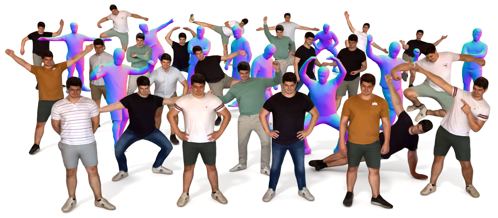

# Hi, I'm Sascha 👋

> Multi-sensor fusion, 3D reconstruction, and generative AI — from research papers to production systems.

## Projects

### Published Research

- 🔋 **[SambaMixer](https://github.com/sascha-kirch/samba-mixer)** - State space models (Mamba) for Li-ion battery health prediction
- 🌈 **[RGB-D-Fusion](https://github.com/sascha-kirch/rgb-d-fusion)** - Image-conditioned depth diffusion for humanoid subjects
- 🎨 **[VoloGAN](https://github.com/sascha-kirch/VoloGAN)** - Adversarial domain adaptation for synthetic depth data

### Tools & Frameworks

- ✨ **[splaty](https://github.com/sascha-kirch/splaty)** - Educational 3D Gaussian Splatting renderer in pure Python/PyTorch
- 🧪 **[DeepSaki](https://github.com/sascha-kirch/DeepSaki)** - TensorFlow/Keras add-on with custom layers, losses, and hardware connectivity
- 🗒️ **[ML_Notebooks](https://github.com/sascha-kirch/ML_Notebooks)** - Machine learning experiments and explorations

### Dev Environment

- ⚙️ **[dotfiles](https://github.com/sascha-kirch/dotfiles)** - Personal dotfiles and utilities (Neovim, tmux, shell configs)
- 🔧 **[linux-forgeup](https://github.com/sascha-kirch/linux-forgeup)** - Lightweight setup and bootstrap tool for Debian/Ubuntu-based systems

### Hardware & Embedded Projects (From the old days)

- 🌦️ **[MeteoPi](https://github.com/sascha-kirch/MeteoPi)** - ESP32-based weather station with database and web interface
- 🌱 **[AquaPi](https://github.com/sascha-kirch/AquaPi)** - Raspberry Pi + Arduino plant watering system with database and web interface
- 📡 **[Communication_Modulation](https://github.com/sascha-kirch/Communication_Modulation)** - Interactive exploration of QAM, PSK, ASK, and BPSK modulation techniques
- 🔎 **[Bit_Error_Tester](https://github.com/sascha-kirch/Bit_Error_Tester)** - FPGA-based bit error rate tester with PRBS generator

## GitHub Activity

## Featured Blog Series

- **[Building a 3D Gaussian Splatting Renderer from Scratch](https://medium.com/@SaschaKirch/list/building-a-3d-gaussian-splatting-renderer-from-scratch-b4b2d38bbccb)** - Hands-on 3DGS implementation
- **[FlashAttention from First Principles](https://medium.com/@SaschaKirch/list/flashattention-from-first-principles-17edc3a49345)** - Understanding attention optimization
- **[Mamba: State Space Models for Images, Videos & Time-Series](https://medium.com/@SaschaKirch/list/mamba-state-space-models-for-images-videos-timeseries-861ae0ad08fb)** - Deep dive into Mamba architecture and applications
- **[NumPy Like a Pro: Arrays & Performance](https://medium.com/@SaschaKirch/list/numpy-like-a-pro-a-deep-dive-into-arrays-and-performance-f68bc294d9c3)** - Performance optimization techniques
- **[Code & Coffee with Sascha](https://medium.com/@SaschaKirch/list/code-coffee-with-sascha-b19b2d737c84)** - Technical discussions and insights
- **[Sascha's Paper Club](https://medium.com/@SaschaKirch/list/saschas-paper-club-89c7847da8e2)** - Research paper breakdowns

> [!Tip]
> For friend links to all my articles, check out [my website's blog collection](https://sascha-kirch.github.io/blog_friend_links.html).

## Connect

---

### What I'm Doing

- **Building autonomous driving perception** - Multi-sensor fusion systems at Bosch
- **Finishing a PhD** - Multi-modal generative deep learning
- **Collaborating on research** - Universidad Politécnica de Madrid on 3D reconstruction and novel view synthesis and Volograms
- **Writing technical deep-dives** - 25+ articles on attention mechanisms, state space models, and foundation architectures
- **Active in IEEE** - Former IEEE-HKN Nu Alpha president in Spain, growing the community
- **Hardware background** - FPGA and radar electronics experience shapes how I optimize models for real-world deployment
